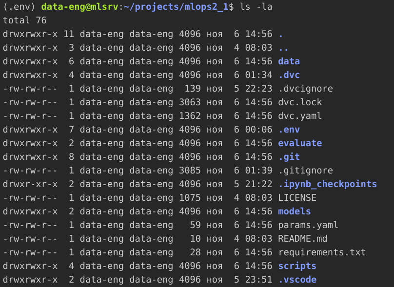

# Практическое задание №1
## Автоматизация администрирования MLOps
Исполнитель - Савоськина С.В.

### Рабочий каталог ML-инженера

### Рабочий каталог data-инженера

### Конвеер dvc

### Запуск эксперимента

### Результаты эксперимента
